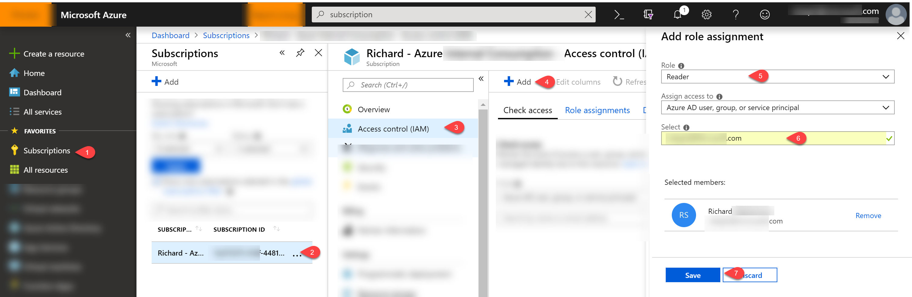

#Directories vs Subscriptions
Your Azure subscription has a trust relationship with Azure Active Directory (Azure AD), which means that the subscription trusts Azure AD to authenticate users, services, and devices. Multiple subscriptions can trust the same Azure AD directory, but each subscription can only trust a single directory.

Before you can grant someone access to your Azure subscription, the user must first be added to your Azure AD.                  

##Add guest users to the directory

To add users to your directory, follow these steps:

1. Sign in to the [Azure portal](https://portal.azure.com) as an Azure AD administrator.
2. In the navigation pane, select **Azure Active Directory**.
3. Under **Manage**, select **Users**.
4. Select **New guest user**.

    

## Add guest users to the subcription

1. In the navigation pane, select **Subscriptions**.
2. Select the subscription you want to work with.
3. Select **Access Control (IAM)**.
4. Select **Add**.
5. Choose the role you want to grant to the user. Owner, contributer, reader, etc. A list of available roles and descriptions are [here](https://docs.microsoft.com/en-us/azure/role-based-access-control/built-in-roles).
6. Type in the user's name or email address. 
7. Select **Save**.

 
